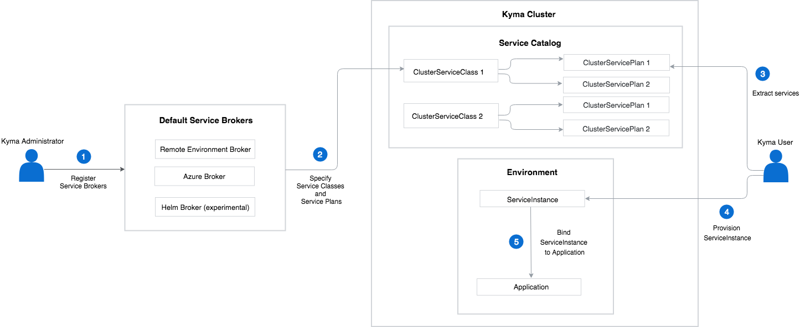

The diagram and steps describe the basic Service Catalog workflow:

1. During the Kyma installation, the system registers the default Service Brokers in the Kyma cluster. The cluster administrator can manually register other Service Brokers in the Kyma cluster.

2. Each ClusterServiceBroker specifies ClusterServiceClasses and service variations called ClusterServicePlans that are available to Kyma users.

3. The user gets a list of the available services in the Kyma web console or CLI.

4. The user chooses a ClusterServiceClass and requests to create its new instance in a given Environment.

5. The user creates a binding to the ServiceInstance to allow the user's application to access the provisioned service.
