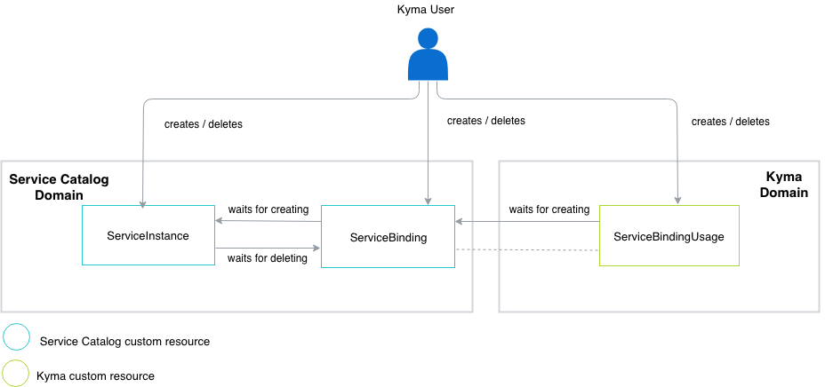
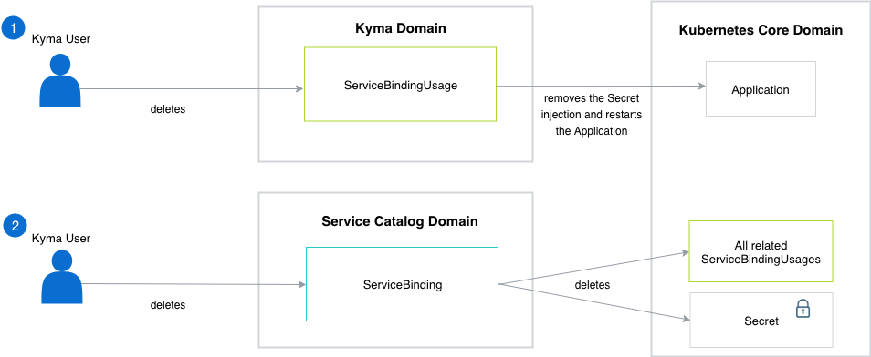

Provisioning a service means creating an instance of a service. When you consume a specific ClusterServiceClass or a ServiceClass, and the system provisions a ServiceInstance, you need credentials for this service. To obtain credentials, create a ServiceBinding resource using the Service Catalog API. One instance can have numerous bindings to use in the application. When you raise a binding request, the system returns the credentials in the form of a Secret. The system creates a Secret in a given Namespace.

> **NOTE:** The security in Kyma relies on the Kubernetes concept of a [Namespace](https://kubernetes.io/docs/concepts/overview/working-with-objects/namespaces/) which is a security boundary. If the Secret exists in the Namespace, the administrator can inject it to any Deployment. The Service Broker cannot prevent other applications from consuming a created Secret. Therefore, to ensure a stronger level of isolation and security, use a dedicated Namespace and request separate bindings for each Deployment.

The Secret allows you to run the service successfully. However, a problem appears each time you need to change the definition of the `yaml` file in the Deployment to specify the Secrets' usage. The manual process of editing the file is tedious and time-consuming. Kyma handles it by offering a custom resource called ServiceBindingUsage. This custom resource applies the Kubernetes [PodPreset](https://kubernetes.io/docs/concepts/workloads/pods/podpreset/) resource and allows you to enforce an automated flow in which the Binding Usage Controller injects ServiceBindings into a given Deployment or Function.

## Provisioning and binding flow

The diagram shows an overview of interactions between all resources related to Kyma provisioning and binding, and the reverting, deprovisioning, and unbinding operations.

The process of provisioning and binding invokes the creation of three custom resources:
- ServiceInstance
- ServiceBinding
- ServiceBindingUsage

The system allows you to create these custom resources in any order, but within a timeout period.

When you invoke the deprovisioning and unbinding actions, the system deletes all three custom resources. Similar to the creation process dependencies, the system allows you to delete ServiceInstance and ServiceBinding in any order, but within a timeout period. However, before you delete the ServiceBinding, make sure you remove the ServiceBindingUsage first. For more details, see the [section](#details-provisioning-and-binding-delete-a-servicebinding) on deleting a ServiceBinding.

### Provision a service

To provision a service, create a ServiceInstance custom resource. Generally speaking, provisioning is a process in which the Service Broker creates a new instance of a service. The form and scope of this instance depends on the Service Broker.

### Create a ServiceBinding

Kyma binding operation consists of two phases:
1. The system gathers the information necessary to connect to the ServiceInstance and authenticate it. The Service Catalog handles this phase directly, without the use of any additional Kyma custom resources.
2. The system must make the information it collected available to the application. Since the Service Catalog does not provide this functionality, you must create a ServiceBindingUsage custom resource.

> **NOTE:** The system allows you to create the ServiceBinding and ServiceBindingUsage resources at the same time.

### Define other types of resources

The UsageKind is a cluster-wide custom resource which allows you to bind a ServiceInstance to any kind of resource. By default, Kyma provides two UsageKinds which enable binding either to a Deployment or a Function. You can add more UsageKinds if you want to bind your ServiceInstance to other types of resources. The UsageKind contains information on how the binding to these custom resources is conducted. The ServiceBindingUsage uses this information to inject Secrets to the application.

### Delete a ServiceBinding

Kyma unbinding can be achieved in two ways:
- Delete the ServiceBindingUsage. The Binding Usage Controller deletes the Secret injection, but the Secret itself still exists in the Namespace.
- Delete the ServiceBinding. It deletes the Secret and triggers the deletion of all related ServiceBindingUsages.

### Deprovision a service

To deprovision a given service, delete the ServiceInstance custom resource. As part of this operation, the Service Broker deletes any resource created during the provisioning. When the process completes, the service becomes unavailable.

> **NOTE:** You can deprovision a service only if no corresponding ServiceBinding for a given ServiceInstance exists.
