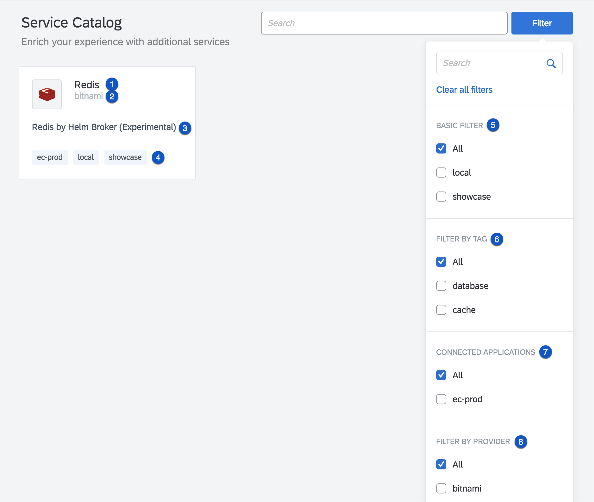
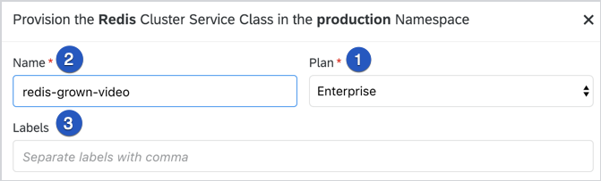
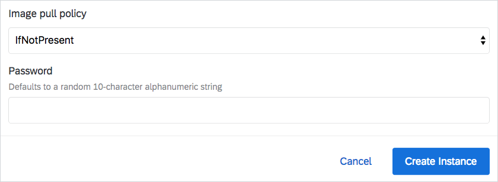

This document describes the mapping of [OSBA service objects](https://github.com/openservicebrokerapi/servicebroker/blob/v2.13/spec.md#service-objects), [plan objects](https://github.com/openservicebrokerapi/servicebroker/blob/v2.13/spec.md#plan-object), and [conventions](https://github.com/openservicebrokerapi/servicebroker/blob/v2.13/profile.md#service-metadata) in the Kyma Console Catalog view.

## Catalog page

These are the OSBA fields used in the main Catalog page:

| Number | OSBA field                        | Fallbacks  | Description                                                                                                                |
| ------ | --------------------------------- | ---------- | -------------------------------------------------------------------------------------------------------------------------- |
| (1)    | **metadata.displayName**              | **name***, **id***| If **metadata.displayName**, **name**, or **id** fields are not present, a given Service Class does not appear on the landing page. |
| (2)    | **metadata.providerDisplayName**      | -          | If not provided, UI does not display this information.                                                                     |
| (3)    | **description\***                     | -          | If not provided, UI does not display this information.                                                                     |
| (4)    | **metadata.labels\*\***               | -          | If not provided, UI does not display any labels.                                                                           |
| (5)    | **metadata.labels.local\*\*** and/or **metadata.labels.showcase\*\*** | - | If not provided, it is not possible to choose a Basic Filter.                                                 |
| (6)    | **tags**                              | -          | If not provided, it is not possible to filter by Tag.                                                                         |
| (7)    | **metadata.labels.connected-app\*\*** | -          | If not provided, it is not possible to choose Connected Applications.                                                          |
| (8)    | **metadata.providerDisplayName**      | -          | If not provided, it is not possible to filter by Provider.                                                                    |

\*Fields with an asterisk are required OSBA attributes.

\*\***metadata.labels** is the custom object that is not defined in the [OSBA metadata convention](https://github.com/openservicebrokerapi/servicebroker/blob/master/profile.md#service-metadata).



## Catalog Details page

These are the OSBA fields used in the detailed Service Class view:

| Number | OSBA field                   | Fallbacks      | Description                                                       |
| ------ | ---------------------------- | -------------- | ----------------------------------------------------------------- |
| (1)    | **metadata.displayName**         | **name***, **id***     | -                                                                 |
| (2)    | **metadata.providerDisplayName** | -              | If not provided, UI does not display this information.            |
| (3)    | not related to OSBA          | -              | -                                                                 |
| (4)    | **metadata.documentationUrl**    | -              | If not provided, the link with documentation does not appear.     |
| (5)    | **metadata.supportUrl**          | -              | If not provided, the link with support does not appear.           |
| (6)    | **tags**                         | -              | If not provided, UI does not display tags.                        |
| (7)    | **metadata.longDescription**     | **description\***  | If not provided, the **General Information** panel does not appear. |
| (8)    | not related to OSBA          | -              | -                                                                 |

\*Fields with an asterisk are required OSBA attributes.


## Add to Namespace

These are the OSBA fields used in the **Add to Namespace** window:

| Number | OSBA field                | Fallbacks            | Description |
| ------ | ------------------------- | -------------------- | ----------- |
| (1)    | **plan.metadata.displayName** | **plan.name***, **plan.id*** |             |
| (2)    | not related to OSBA       | -                    |             |
| (3)    | not related to OSBA       | -                    |             |

\*Fields with an asterisk are required OSBA attributes.



### Plan schema

A [plan object](https://github.com/openservicebrokerapi/servicebroker/blob/v2.13/spec.md#plan-object) in the OSBA can have the **schemas** field. Schema is used to generate a form which enables provisioning of the Service Class.

See the sample schema:

```
{
          "$schema": "http://json-schema.org/draft-04/schema#",
          "properties": {
            "imagePullPolicy": {
              "default": "IfNotPresent",
              "enum": [
                "Always",
                "IfNotPresent",
                "Never"
              ],
              "title": "Image pull policy",
              "type": "string"
            },
            "redisPassword": {
              "default": "",
              "format": "password",
              "description": "Redis password. Defaults to a random 10-character alphanumeric string.",
              "title": "Password (Defaults to a random 10-character alphanumeric string)",
              "type": "string"
            }
          },
          "type": "object"
        }
```

This sample renders in the following way:



Follow these rules when you design schema objects:

* If the field has limited possible values, use the **enum** field. It renders as a dropdown menu, so it prevents the user from making mistakes.
* If the field is required for the Service Class, mark it as **required**. UI blocks provisioning if you do not fill in the required fields.
* Fill the **default** value for a field whenever possible, it makes the provisioning faster.
* If the field, such as the password field, must be starred, use the **format** key with the **password** value.
