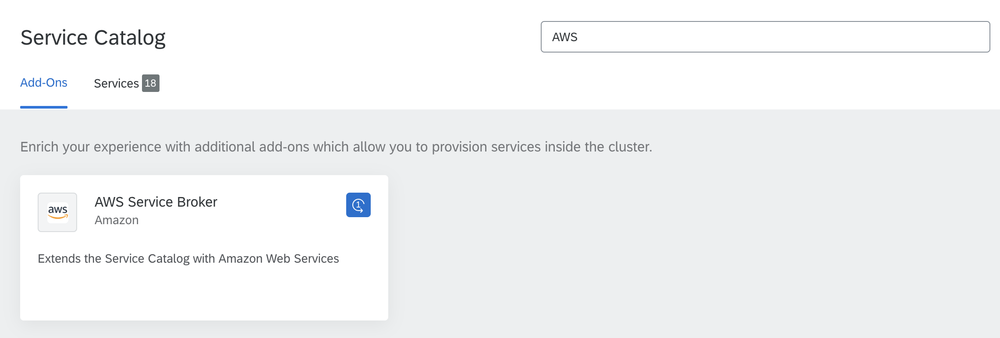

The AWS Service Broker is an open-source, [Open Service Broker](https://www.openservicebrokerapi.org/)-compatible API server that provisions managed services in the AWS public cloud. Kyma provides the Namespace-scoped AWS Service Broker. In each Namespace, you can configure the AWS Service Broker against different subscriptions. Install the AWS Service Broker by provisioning the **AWS Service Broker** class provided by the Helm Broker.

Once you provision the **AWS Service Broker** class, the AWS Service Broker classes are available in the Service Catalog view in a given Namespace.
The AWS Service Broker provides these Service Classes to use with the Service Catalog:

* Amazon Athena
* Amazon EMR
* Amazon Kinesis
* Amazon RDS for MariaDB
* Amazon RDS for PostgreSQL
* Amazon Translate
* Amazon KMS
* Amazon Rekognition
* Amazon SNS
* Amazon DynamoDB
* Amazon Redshift
* Amazon SQS
* Amazon Polly
* Amazon RDS for MySQL
* Amazon S3
* Amazon Lex
* Amazon Route53
* Amazon ElastiCache

Find the documentation for each Service Class [here](https://github.com/awslabs/aws-servicebroker/tree/v1.0.0/templates). You can also see the details and specification of each Service Class in the Service Catalog UI, after provisioning a given class.

For more information about the Service Brokers, see [this](#service-brokers-overview) document.

>**NOTE:** Kyma uses the AWS Service Broker open-source project. To ensure the best performance and stability of the product, Kyma uses a version of the AWS Service Broker that precedes the newest version released by Amazon.
