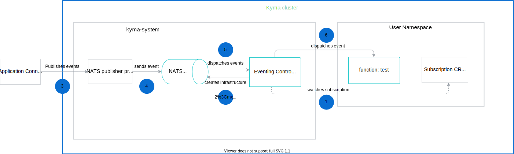

The event processing and delivery flow uses the NATS server to process events and send them to subscribers.
This diagram explains the event flow in Kyma, from the moment the Application sends an event, to the point when the event triggers the Function.

1. The Eventing Controller watches the Subscription Custom Resource. It determines if there are any new incoming events.

2. The Eventing Controller creates an infrastructure for the NATS server.

3. The [Application Connector](/components/application-connector/) publishes events to the Event Publisher Proxy.

4. The Event Publisher Proxy sends events to the NATS server.

5. The NATS server dispatches events to the Eventing Controller.

6. The Eventing Controller dispatches events to subscribers (microservices or Functions).
