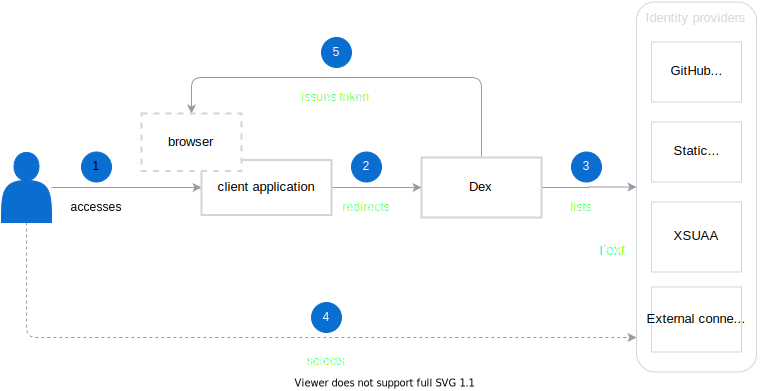

## User authentication

The identity federation in Kyma is managed through [Dex](https://github.com/dexidp/dex), an open-source, [OpenID Connect](https://openid.net/connect/) identity provider. 

The diagram shows the user authentication flow, focusing on the role Dex plays in the process.



1. Access the client application, such as the Kyma Console, Grafana UI, or Jaeger UI. 
2. If the application does not find a [JWT token](#ID-Tokens) in the browser session storage, it will redirect you to Dex to handle the authentication.
3. Dex lists all the defined identity providers in your browser window.

    >**NOTE:** Out of the box, Kyma implements the [static user store](/components/security#details-authentication-in-kyma-static-user-store) Dex uses to authenticate users. You can add a custom external identity provider by following steps in this [tutorial](#tutorials-add-an-identity-provider-to-dex).

4. Select the identity provider and provide the data required for authentication.
5. After successful authentication, Dex issues a JWT token that is stored in the browser session and used for all subsequent requests. This means that if you want to use a different UI, such as Jaeger or Grafana, Dex will use the stored token instead of requesting you to log in again.

### Static user store

The static user store is designed for use with local Kyma deployments as it allows to easily create predefined users' credentials by creating Secret objects with a custom `dex-user-config` label.
Read the [tutorial](#tutorials-manage-static-users-in-dex) to learn how to manage users in the static store used by Dex.

 >**NOTE:** The static user connector serves as a demo, and does not offer full functionality when compared to other connectors. As such it does not provide the `groups` claim, which is extensively used in Kyma.

### ID Tokens

 ID Tokens are JSON Web Tokens (JWTs) signed by Dex and returned as part of the OAuth2 response that attest to the end user's identity.
 An example decoded JWT looks as follows:

```json
{
  "iss": "http://127.0.0.1:5556/dex",
  "sub": "CgcyMzQyNzQ5EgZnaXRodWI",
  "aud": "example-app",
  "exp": 1492882042,
  "iat": 1492795642,
  "at_hash": "bi96gOXZShvlWYtal9Eqiw",
  "email": "jane.doe@coreos.com",
  "email_verified": true,
  "groups": [
    "admins",
    "developers"
  ],
  "name": "Jane Doe"
}
```

>**NOTE:** You can customize the expiration settings of the tokens by creating [overrides](/root/kyma#configuration-helm-overrides-for-kyma-installation) to the [configuration](https://github.com/kyma-project/kyma/blob/master/resources/dex/values.yaml#L59) of the Dex component chart.

## Service-to-service authentication

As Kyma is build on top of Istio Service Mesh, service-to-service authentication and encryption is enabled with [Istio MutualTLS](https://istio.io/latest/docs/concepts/security/#mutual-tls-authentication). For details, read the [Kyma-specific Istio configuration](/components/service-mesh/#details-istio-setup-in-kyma-kyma-specific-configuration) documentation.

## User-to-service authentication

Kyma uses a custom [API Gateway](/components/api-gateway/#overview-overview) component that is build on top of [ORY Oathkeeper](https://www.ory.sh/oathkeeper/docs/). The API Gateway allows exposing user applications within the Kyma environment and secures them if necessary. You can then access the secured resources using [authentication options](/components/api-gateway/#architecture-architecture-request-flow).