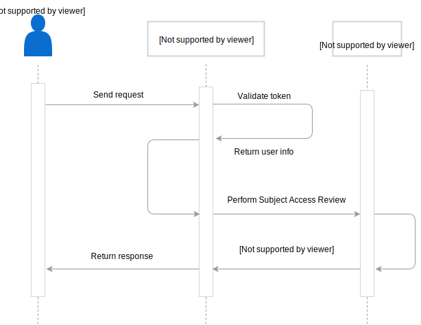

Kyma uses a custom [GraphQL](http://graphql.org/) implementation in the Console Backend Service and deploys an RBAC-based logic to control the access to the GraphQL endpoint. All calls to the GraphQL endpoint require a valid Kyma token for authentication.

The authorization in GraphQL uses RBAC, which means that:
  - All of the Roles, RoleBindings, ClusterRoles and CluserRoleBindings that you create and assign are effective and give the same permissions when users interact with the cluster resources both through the CLI and the GraphQL endpoints.
  - To give users access to specific queries you must create appropriate Roles and bindings in your cluster.

The implementation assigns GraphQL actions to specific Kubernetes verbs:

| GraphQL action | Kubernetes verb(s) |
|---|---|
| **query** | get (for a single resource) <br> list (for multiple resources) |
| **mutation** | create, delete |
| **subscription** | watch |

> **NOTE:** Due to the nature of Kubernetes, you can secure specific resources specified by their name only for queries and mutations. Subscriptions work only with entire resource groups, such as kinds, and therefore don't allow for such level of granularity.

## Available GraphQL actions

To access cluster resources through GraphQL, an action securing given resource must be defined and implemented in the cluster.
See the [GraphQL schema](https://github.com/kyma-project/kyma/blob/master/components/console-backend-service/internal/gqlschema/schema.graphql) file for the list of actions implemented in every Kyma cluster by default.

## Secure a defined GraphQL action

This is an example GraphQL action implemented in Kyma out of the box.

  ```
  microFrontends(namespace: String!): [MicroFrontend!]! @HasAccess(attributes: {resource: "microfrontends", verb: "list", apiGroup: "ui.kyma-project.io", apiVersion: "v1alpha1"})

  ```

This query secures the access to [MicroFrontend](/components/console/#custom-resource-micro-frontend) custom resources with specific names. To access it, the user must be bound to a role that allows to access:
  - resources of the MicroFrontend kind
  - the Kubernetes verb `list`
  - the `ui.kyma-project.io` apiGroup


To allow access specifically to the example query, create this RBAC role in the cluster and bind it to a user or a client:

  ```
  apiVersion: rbac.authorization.k8s.io/v1beta1
  kind: Role
  metadata:
    name: kyma-microfrontends-query-example
  rules:
  - apiGroups: ["ui.kyma-project.io"]
    resources: ["microfrontends"]
    verbs: ["list"]
  ```

> **NOTE:** Read also about [RBAC authorization in a Kubernetes cluster](https://kubernetes.io/docs/reference/access-authn-authz/rbac/).

## Request flow
This diagram illustrates the request flow for the Console Backend Service which uses a custom [GraphQL](http://graphql.org/) implementation:



1. The user sends a request with an ID token to the GraphQL application.
2. The GraphQL application validates the user token and extracts user data required to perform [Subject Access Review](https://kubernetes.io/docs/reference/access-authn-authz/authorization/#checking-api-access) (SAR).
3. The [Kubernetes API Server](https://kubernetes.io/docs/reference/command-line-tools-reference/kube-apiserver/) performs SAR.
4. Based on the results of SAR, the Kubernetes API Server informs the GraphQL application whether the user can perform the requested [GraphQL action](#details-graph-ql-available-graph-ql-actions).
5. Based on the information provided by the Kubernetes API Server, the GraphQL application returns an appropriate response to the user.

>**NOTE:** Read more about the [custom GraphQL implementation in Kyma](#details-graph-ql).
