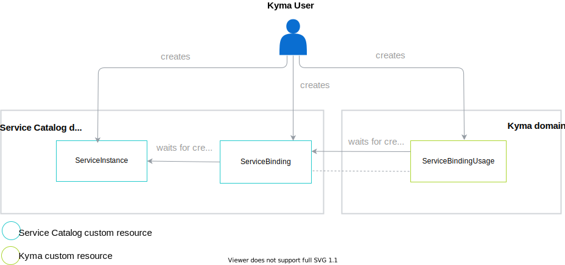
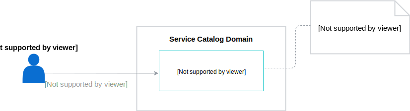
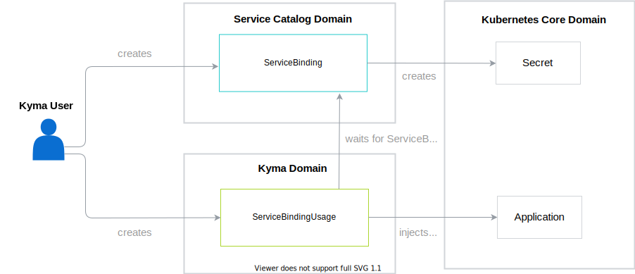
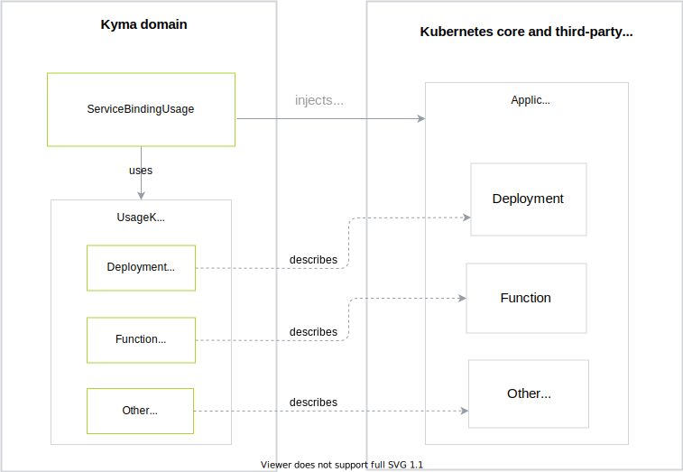

The diagram shows an overview of interactions between all resources related to the processes of provisioning and binding:

## Provision a service

Provisioning a service means creating an instance of a service. To provision a service, create a ServiceInstance custom resource. During this process, the Service Broker creates a new instance of a service. The form and scope of this instance depends on the Service Broker.

## Bind a service

Binding is a process of connecting a ServiceInstance and an application. The binding process consists of two parts:

- User creates a ServiceBinding. When you create a ServiceBinding, the Service Catalog creates a Secret with credentials needed to access the application.
- User creates a ServiceBindingUsage. After creating this custom resource, ServiceBindingUsage uses the [PodPreset](https://v1-19.docs.kubernetes.io/docs/concepts/workloads/pods/podpreset/) to inject credentials into the application, which allows you to consume the service.

> **TIP:** You can create the ServiceBinding and ServiceBindingUsage resources at the same time.

By default, you can bind a ServiceInstance either to a Deployment or to a Function. Additionally, Kyma provides the [UsageKind custom resource](#custom-resource-usage-kind), which is a cluster-wide custom resource that allows you to bind a ServiceInstance to any kind of resource. You can add more UsageKinds if you want to bind your ServiceInstance to other types of resources. UsageKind contains information on how the binding to these custom resources is conducted. ServiceBindingUsage uses this information to inject Secrets to the Application.

