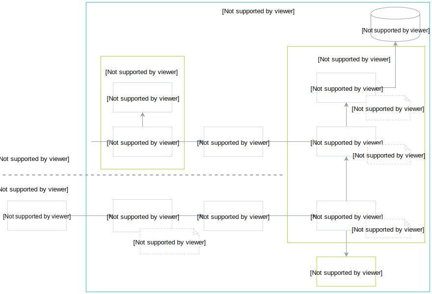

In Kyma, tracin component provides the necessary functionality to collect and query traces. Both operations may occur at the same time, meaning that you can retrieve specific traces using the Jeager UI, while at the same time Jaeger and [Zipkin](https://zipkin.io/) take care of proper trace collection ans storage. See the diagram for details: 

## Collect traces

The process of collecting traces by Jaeger looks as follows:
 
1. The application receives trace data.
2. Istio Proxy configured for the application makes sure to propagate the correct [HTTP headers](/components/tracing#details-propagate-http-headers) of the requests further to the `zipkin` service, responsible for looking up and collecting traces from various distributed systems.
3. Zipkin receives the data and passes it further through [Istio Proxy](https://github.com/istio/proxy) which provides further authorization mechanisms to ensure proper communication. 
4. Jaeger processes the data. Specifically, the  `jaeger-agent` service receives the spans, batches them and forwards to collectors. 
5. The data is then saved in the database.

## Query traces

The process of querying traces from Jaeger looks as follows:

1. A Kyma user accesses the Jaeger UI to [look for specific traces](/components/tracing#details-search-for-traces).
2. Jaeger UI passes the request to the `jaeger-query` service. The requests goes through the [Istio Ingress Gateway](https://kyma-project.io/docs/components/application-connector/#architecture-application-connector-components-istio-ingress-gateway) which receives and processes the incoming connections between the service and the external source.
3. The `jaeger-query` service passes the request to the [Keycloak Gatekeeper](https://github.com/keycloak/keycloak-gatekeeper) for verification. The Gatekeeper calls [Dex](https://github.com/dexidp/dex) to authenticate the user and the request, and grants further access if the authentication is successful. 
4. The request goes through [Istio Proxy](https://github.com/istio/proxy) which provides further authorization mechanisms to ensure proper communication. 
5. Finally, the functionality provided by the Jaeger Deployment enables the retrival of trace information. 

