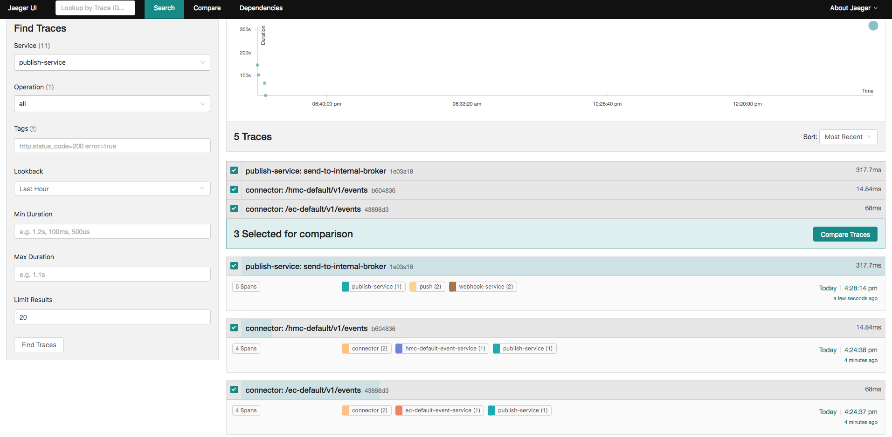
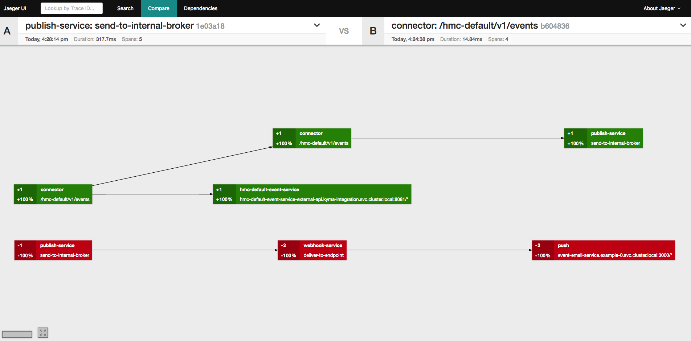
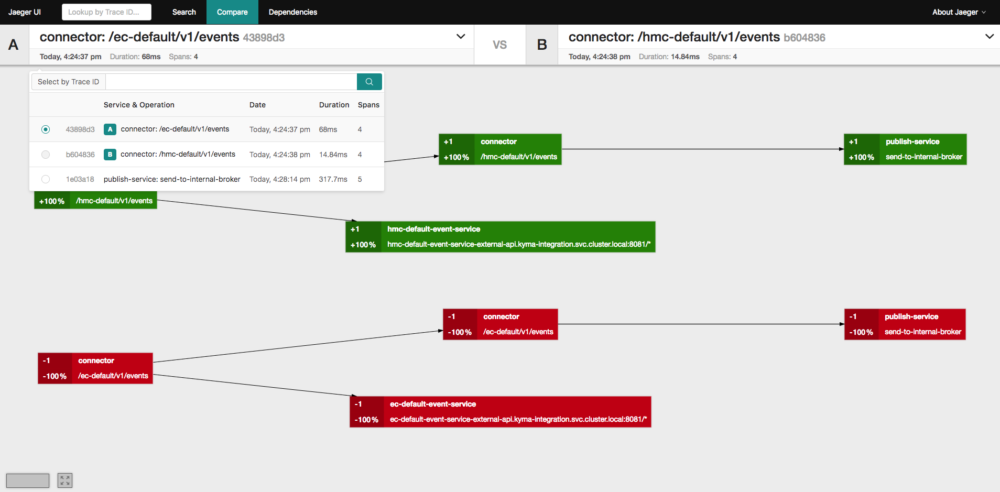
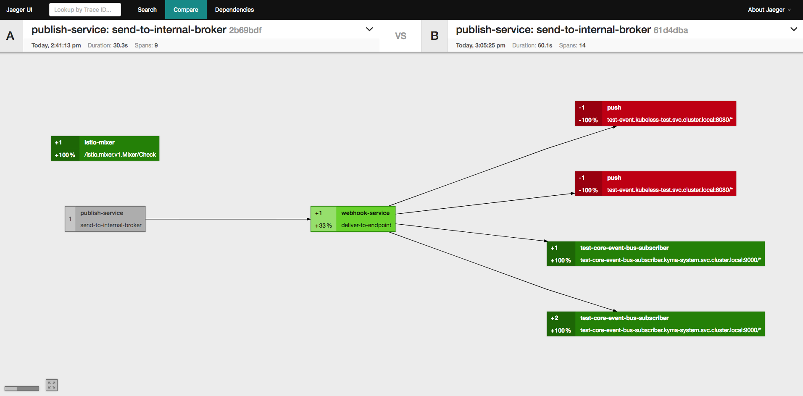

Trace comparison allows you to compare the structure of two traces, rendered as a tree of connected services and operations. The colors help you to distinguish the differences between two traces.

Compare the traces using the **Jaeger** user interface.

1. In the search page for traces, select the traces to compare and click **Compare Traces**.

   

2. The page shows the comparison of two traces selected in the previous step. The traces are marked with **A** and **B**.

   

3. Use the top menus for **A** and **B** to select the traces you want to compare.

   
   
   Trace spans have different colors which indicate their meaning:
   * Dark colors indicate that the span is missing from one of the traces:
     * Dark red: The span is only present in trace **A**.
     * Dark green: The span is only present in trace **B**.
   * Light colors indicate that the span is present in both traces but occurs more often in one of the traces:
     * Light red: The span in **A** has more spans than **B**.
     * Light green: The span in B has more spans than **A**.
   * Gray: indicates that two traces have a span and the same number of further spans grouped in it.
  
   Additionally, spans are marked with numerical values indicating how often they occur in compared traces. The values can be positive or negative.
   
   >**NOTE:** Missing spans can be interpreted as either the application not calling the downstream service, which might be a bug, or that the downstream service is down.

   