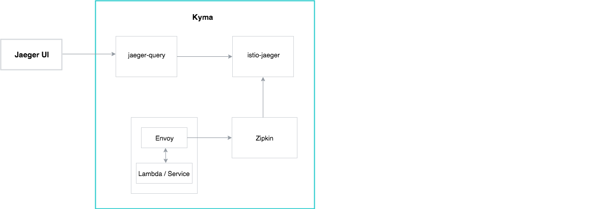
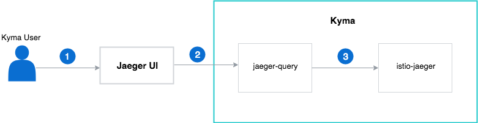
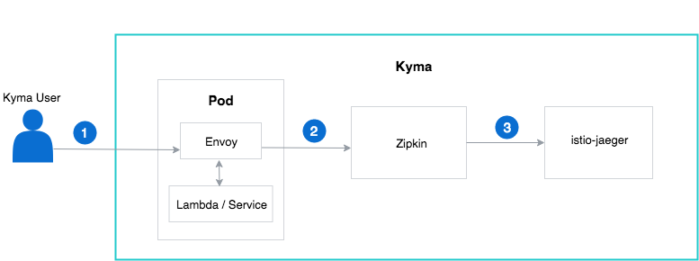

See the diagram and steps for an overview of the tracing flow in Kyma:

The central element of the tracing architecture in Kyma is istio-jaeger. This main component serves both as a target of all query requests made from the Jaeger UI and the space for storing and processing the spans and traces created by Envoy and Kyma services.

## Request traces

1. Kyma user accesses Jaeger UI and requests the trace details for a given service by selecting the service from the **Services** drop-down menu and confirming the choice by selecting the **Find Traces** button.
2. Jaeger passes the request to the the UI facade, jaeger-query.
3. The jaeger-query forwards the details to the istio-jaeger component which sends the information back.

## Store traces

1. Kyma user configures the application to propagate the correct [HTTP headers](https://istio.io/docs/tasks/telemetry/distributed-tracing.html#understanding-what-happened) for the outbound calls.
2. Envoy passes the trace details to the Zipkin Kubernetes service. This service acts as a facade to receive the trace and span details.
3. Zipkin service forwards the tracing information to the istio-jaeger component which processes the received details.

