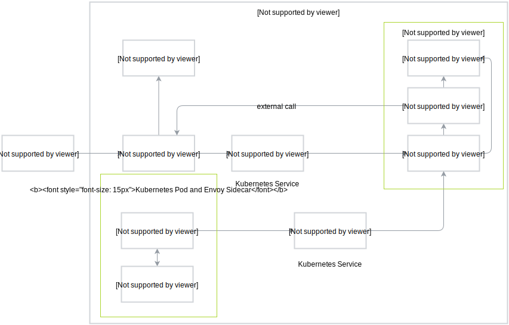
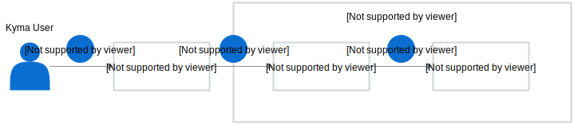

The diagram presents the tracing flow including the details of requesting and storing traces. 

The Jaeger Deployment is the central element of the tracing architecture.
It serves both as a target of all query requests sent from the Jaeger UI and the space for storing and processing the spans and traces created by Envoy, Istio and Kyma services. 

## Request traces

1. A Kyma user accesses Jaeger UI. Dex and kcproxy handle the user authentication.
2. The user uses the UI to request the trace details for a given service by selecting the service from the **Services** drop-down menu and confirming the choice by selecting the **Find Traces** button. Jaeger passes the request to jaeger-query, which is the UI facade.
4. The jaeger-query forwards the details to Jaeger Deployment. The kcproxy verifies each request and if the authentication is successful, Jaeger sends the requested information back.

## Store traces

1. A Kyma user configures the application to propagate the correct [HTTP headers](https://istio.io/docs/tasks/telemetry/distributed-tracing.html#understanding-what-happened) for the outbound calls.
2. Envoy passes the trace details to the Zipkin Kubernetes service. This service acts as a facade to receive the trace and span details.
3. The Zipkin service forwards the tracing information to Jaeger Deployment which processes the received details. 

