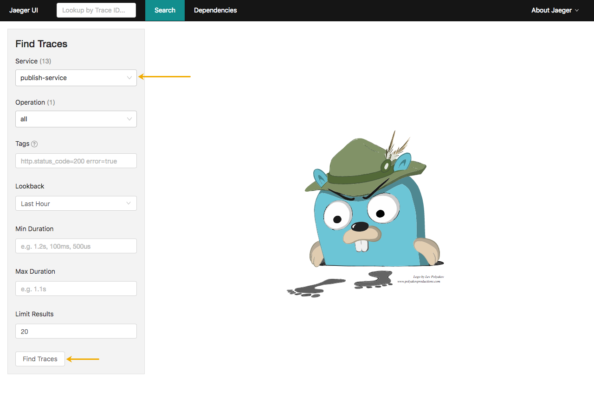
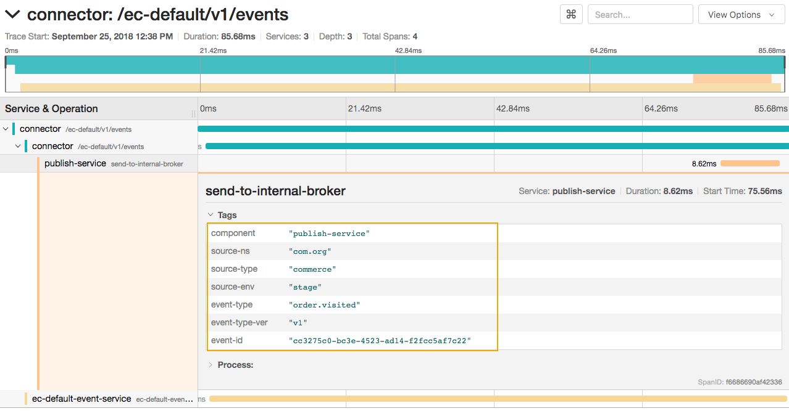

Using tracing you can troubleshoot different problems you might encounter while using Kyma. Understanding some common scenarios and how the expected traces look like will you have a better grasp on how to quickly use Kyma tracing capabilities to pin point the root cause.

### I have no microservice or lambda configured to receive an event

#### Scenario

There is an Event sent from the external system (for example: The Enterprise Commerce) but there is no lambda or microservice configured with the Event trigger.

#### Expected Traces

Only the trace for the “publish” and initial services will be visible as shown belown

In the trace details, you can see the tags for the “publish-service”

