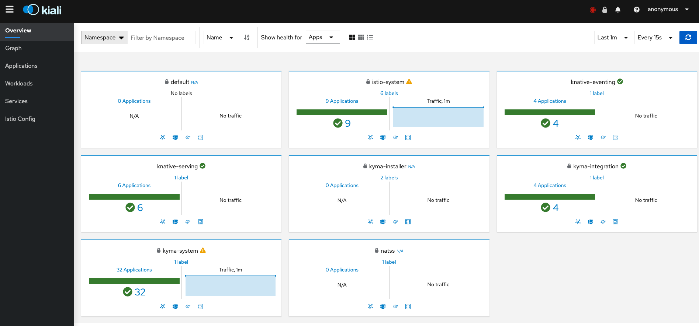
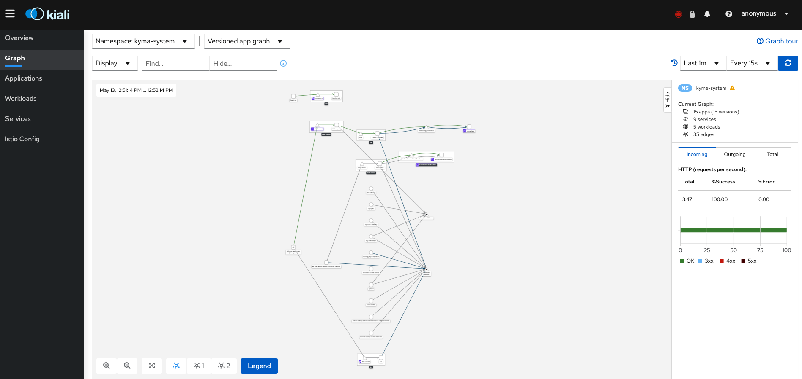

> **WIP**: This tutorial needs an update to reflect a more holistic perspective.

1. To access Kiali, go to the [Kyma Console](/components/console/#overview-overview). 

2. Click the **Service Mesh**  tab in the menu on the left.
Once you are authenticated, the main Kiali dashboard will show a summary of the Service Mesh status and the left side menu will offer you features such as graphs or configuration validation:

3. Use the graphs to review the topology of the Service Mesh:

