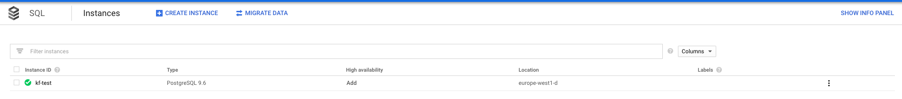
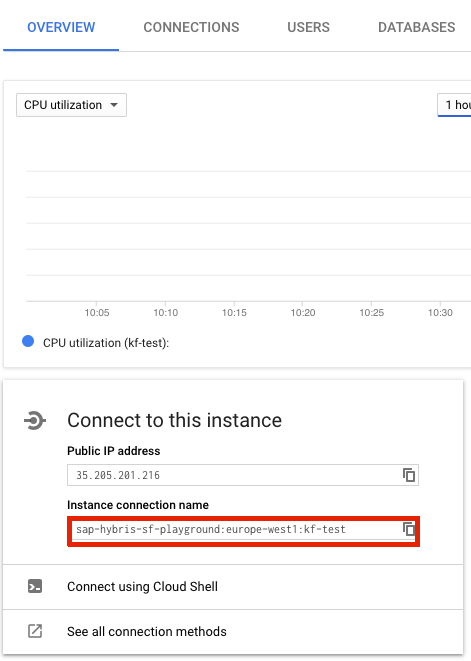

# Configure Managed GCP PostgreSQL

## Prerequisites

To set up the database, create the following:

* Cloud SQL Postgres instance on Google Cloud Platform with public IP assigned
* Key for GCP Service Account with at least one of the following roles ([click here for more information](https://cloud.google.com/sql/docs/postgres/connect-external-app#4_if_required_by_your_authentication_method_create_a_service_account)):
  - Cloud SQL Client
  - Cloud SQL Editor
  - Cloud SQL Admin

## Install Compass with managed GCP PostgreSQL database

To install Compass with GCP managed Postgres database, set the **database.embedded.enabled** value to `false` inside the `./chart/compass/values.yaml` file, and fill these values:

| Parameter | Description | Values | Default |
| --- | --- | --- | --- |
| `global.database.managedGCP.serviceAccountKey` | Specifies base64 encoded the key for GCP Service Account mentioned in prerequisites. | base64 encoded string | "" |
| `global.database.managedGCP.instanceConnectionName` | Specifies instance connection name to GCP PostgreSQL database | string | "" |
| `global.database.managedGCP.director.user` | Specifies the database username in the Director. | string | "" |
| `global.database.managedGCP.director.password` | Specifies the password to the user's database in the Director. | string | "" |
| `global.database.managedGCP.director.name` | Specifies the database name in the Director. | string | "" |
| `global.database.managedGCP.provisioner.user` | Specifies the database username in the Runtime Provisioner. | string | "" |
| `global.database.managedGCP.provisioner.password` | Specifies the password to the user's database in the Runtime Provisioner. | string | "" |
| `global.database.managedGCP.provisioner.name` | Specifies the database name in the Runtime Provisioner. | string | "" |
| `global.database.managedGCP.broker.user` | Specifies the database username in Kyma Environment Broker. | string | "" |
| `global.database.managedGCP.broker.password` | Specifies the password to the user's database in Kyma Environment Broker. | string | "" |
| `global.database.managedGCP.broker.name` | Specifies the database name in Kyma Environment Broker. | string | "" |
| `global.database.managedGCP.host` | Specifies cloudsql-proxy host | string | "localhost" |
| `global.database.managedGCP.hostPort` | Specifies cloudsql-proxy port | string | "5432" |
| `global.database.managedGCP.sslMode` | Specifies SSL connection mode | string | "" |

To connect to managed database, we use [cloudsql-proxy](https://cloud.google.com/sql/docs/postgres/sql-proxy) provided by Google, which consumes `serviceAccountKey` and `instanceConnectionName` values.

To find `Instance connection name`, go to the [SQL Instances page](https://console.cloud.google.com/sql/instances) and open desired database overview.

Than look for `Instance connection name` box inside `Connect to this instance` section.

For the `director.user`, `provisioner.user`, `broker.user`, `director.password`, `provisioner.password`, and `broker.password` values, use one of the accounts from the **USERS** tab. The `director.name`, `provisioner.name`, and `broker.name` values are the names of available databases. For the list of available names, see the **DATABASES** tab.

The `host` and the `hostPort` values specifies the cloudsql-proxy host and port. These are used directly by application to connect to proxy, and further to database.

The `sslMode` value specifies SSL connection mode to database. Check possible values [here](https://www.postgresql.org/docs/9.1/libpq-ssl.html) under `SSL Mode Descriptions` section.
