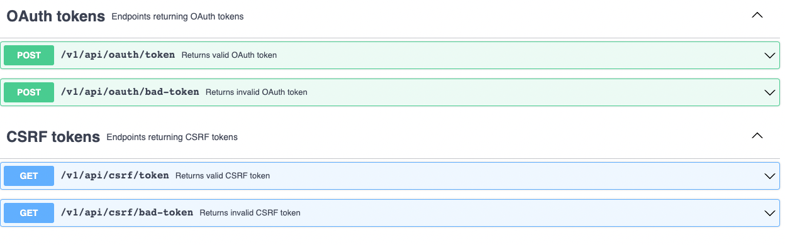
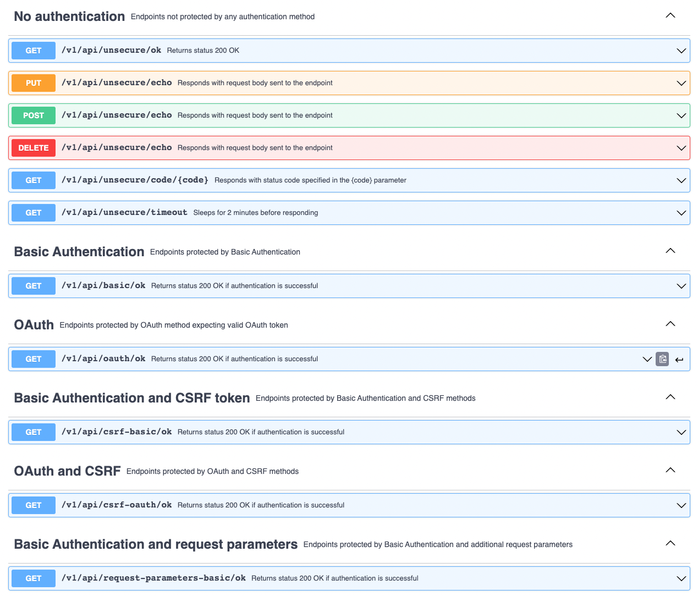
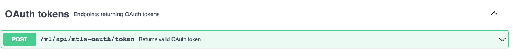

# Component tests for Application Connector

These are the component tests for Application Connector.

<!-- markdown-toc start - Don't edit this section. Run M-x markdown-toc-refresh-toc -->
**Table of Contents**

- [Design and architecture](#design-and-architecture)
- [Mock application](#Mock-application)
- [Building](#building)
- [Running](#running)
    - [Deploy a Kyma cluster locally](#deploy-a-kyma-cluster-locally)
    - [Run the tests](#run-the-tests)
- [Debugging](#debugging)
    - [Running locally](#running-locally)
    - [Running without cleanup](#running-without-cleanup)

<!-- markdown-toc end -->

## Design and architecture

The tests consist of:
- [Application CRs](./resources/charts/gateway-test/templates/applications/) describing the test cases
- [Secrets](./resources/charts/gateway-test/templates/applications/credentials) referenced by the Application CRs
- [Test runners](./test/application-gateway/) with various check for subsets of cases, grouped by the Application CRs
- [Mock application](./tools/external-api-mock-app/) which simulates the remote endpoints

Additionally, the following resources are created on the cluster:
- [Service Account](./resources/charts/gateway-test/templates/service-account.yml#L2), used by the tests to read the Application CRs
- [Secrets](./resources/charts/gateway-test/templates/target-api-mock/credentials) used by the Mock application to configure mTLS servers 

The tests are executed as a Kubernetes Job on a Kyma cluster, where the tested Application Gateway is installed. 
The test Job and the mock application deployment are in the `test` Namespace. 


## Mock application

Mock application exposes the following APIs:
- API on port `8080` implementing various authentication methods and returning tokens
- API on port `8090` implementing `mTLS` authentication and returning `OAuth` tokens
- API on port `8091` implementing `mTLS` authentication and using expired server certificate

### API exposed on port `8080` 
There is the following API for getting tokens to be used for `OAuth` and `CSRF` protected endpoints: 


There is the following API for testing authentication methods:


The credentials used for authentication such as `user` and `password` are hardcoded in the [code](./tools/external-api-mock-app/config.go).

### API exposed on port `8090`
There is the following API for getting tokens to be used for `OAuth` protected endpoints:


There are the following API for testing authentication methods:


The credentials used for authentication such as `clientID` are hardcoded in the [code](./tools/external-api-mock-app/config.go). 
The server key, server certificate and CA root certificate for port `8090` are defined in [this](./resources/charts/gateway-test/templates/target-api-mock/credentials/mtls-cert-secret.yml) secret.

> **Note:** Port `8090` needs to be excluded from redirection to Envoy otherwise Application Gateway won't be able to pass client certificate to the mock application.

### API exposed on port `8091`

The API is identical to the one exposed on port '8090'. HTTPS server on port `8091` uses expired server certificate.
The server key, server certificate and CA root certificate for port 8091 are defined in [this](./resources/charts/gateway-test/templates/target-api-mock/credentials/expired-mtls-cert-secret.yaml) secret.

> **Note:** Port `8091` needs to be excluded from redirection to Envoy otherwise Application Gateway won't be able to pass client certificate to the mock application.
 
### Certificates
In order to test mTLS related authentication methods the following is needed:
- Server certificate, key and CA certificate to be used by Mock application
- Client certificate and key stored in a secret accessed by Application Gateway 

All certificates are generated by using the `generate-certs` target from the `Makefile`. 
The target is executed before tests are run and invokes [generate-self-signed-certs.sh](./scripts/generate-self-signed-certs.sh) that creates CA root, server, and client certificates and keys. 

> **Note:** Since self-signed certificates are used Application CRs have `skipVerify: true` property to force Application Gateway needs to skip certificate verification.

## Building

Pipelines build the mock application and the gateway test using the `release` target from the `Makefile`.

To build **and push** the Docker images of the tests and the mock application:

``` sh
./scripts/local-build.sh {DOCKER_TAG} {DOCKER_PUSH_REPOSITORY}
```
This will build the following images:
- `{DOCKER_PUSH_REPOSITORY}/gateway-test:{DOCKER_TAG}`
- `{DOCKER_PUSH_REPOSITORY}/mock-app:{DOCKER_TAG}`

## Running

Tests can be run on any Kyma cluster with Application Gateway.

Pipelines run the tests using the `test-gateway` target from the `Makefile`

### Deploy a Kyma cluster locally

1. Provision a local Kubernetes cluster with k3d:
   ```sh
   kyma provision k3d
   ```

1. Install the minimal set of components required to run Application Gateway for either Kyma OS or SKR:

    <div tabs name="Kyma flavor" group="minimal-kyma-installation">
    <details open>
    <summary label="OS">
    Kyma OS
    </summary>

    ```sh
    kyma deploy --components-file ./resources/installation-config/mini-kyma-os.yaml
    ```

    </details>
    <details>
    <summary label="SKR">
    SKR
    </summary>

    ```bash
    kyma deploy --components-file ./resources/installation-config/mini-kyma-skr.yaml 
    ```

    </details>
    </div>

    >**TIP:** Read more about Kyma installation in the [official Kyma documentation](https://kyma-project.io/docs/kyma/latest/02-get-started/01-quick-install/#install-kyma).

### Run the tests

``` sh
make test-gateway
```

By default, the tests clean up after themselves, removing all the previously created resources and the `test` Namespace.

> **CAUTION:** If the names of your existing resources are the same as the names used in the tests, running this command overrides or removes the existing resources.

## Debugging

### Running locally

> **CAUTION:** Because of the way it accesses the Application CRs, the test Job must run **on a cluster**.
> Application Gateway and the mock application can both be run locally.

To run the mock application locally, follow these steps:
1. Change all the **targetUrl** values in the [Application CRs](./resources/charts/gateway-test/templates/applications/) to reflect the new application URL. For example, `http://localhost:8081/v1/api/unsecure/ok`.
2. Change all the **centralGatewayUrl** values to reflect the new Application Gateway URL. For example, `http://localhost:8080/positive-authorisation/unsecure-always-ok`.
3. Deploy all the resources on the cluster.
   > **NOTE:** you can omit the test Job and the Central Gateway, but it's easier to just let them fail
4. Build the mock application:
   
   <div tabs name="Mock App Build Flavor" group="mock-app-flavor">
   <details open>
   <summary label="dockerized">
   Docker
   </summary>

   ```shell
   export DOCKER_TAG="local"
   export DOCKER_PUSH_REPOSITORY="{DOCKER_USERNAME}"
   make image-mock-app
   ```

   </details>
   <details>
   <summary label="local">
   Local
   </summary>

   Change the hardcoded application port in [`config.go`](./tools/external-api-mock-app/config.go), and run:
   ```shell
   go build ./tools/external-api-mock-app/
   ```
   </details>
   </div>
5. Run the mock application:
   
   <div tabs name="Mock App Run Flavor" group="mock-app-flavor">
   <details open>
   <summary label="dockerized">
   Docker
   </summary>

   ```shell
   docker run -p 8180:8080 -p 8190:8090 -v "$PWD/k8s/gateway-test/certs:/etc/secret-volume:ro" "$DOCKER_PUSH_REPOSITORY/mock-app:$DOCKER_TAG"
   ```

   </details>
   <details>
   <summary label="local">
   Local
   </summary>

   ```shell
   ./external-api-mock-app
   ```
   > **CAUTION:** For the certificates to work, you must copy them from `./k8s/gateway-test/certs` to `/etc/secret-volume`.

   </details>
   </div>
6. Run [Application Gateway](https://github.com/kyma-project/kyma/tree/main/components/central-application-gateway) with the `-kubeConfig {PATH_TO_YOUR_KUBECONFIG_FILE}` parameter.

You can now send requests to Application Gateway, and debug its behavior locally.

### Running without cleanup

To run the tests without removing all the created resources afterwards, run:

``` shell
make disable-sidecar-for-mtls-test test-gateway-debug
```

Once you finished debugging, run:

``` shell
make clean-gateway-test enable-sidecar-after-mtls-test
```