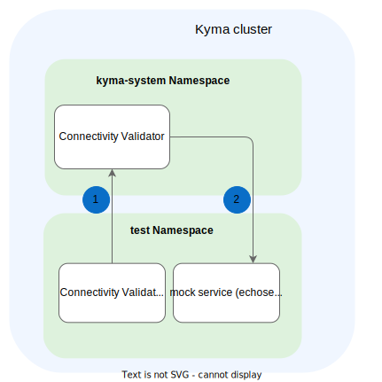

# Application Connectivity Validator

**Table of Contents**

- [Application Connectivity Validator](#application-connectivity-validator)
  - [Design and Architecture](#design-and-architecture)
  - [Building](#building)
  - [Running](#running)
    - [Deploy a Kyma Cluster Locally](#deploy-a-kyma-cluster-locally)
    - [Run the Tests](#run-the-tests)
  - [Debugging](#debugging)
    - [Running Without Cleanup](#running-without-cleanup)
  
## Design and Architecture

The tests consist of:
- [Test resources](../resources/charts/application-connectivity-validator-test/) used to perform the test
- [Test runner](../test/application-connectivity-validator/) with all the test cases

The tests are executed as a Kubernetes Job in a Kyma cluster where the tested Application Connectivity Validator is installed. The test Job is deployed in the `test` namespace.



> **NOTE:** Port `8080` must be excluded from redirection to Envoy, otherwise the Connectivity Validator test Pod cannot pass the `X-Forwarded-Client-Cert` header to Connectivity Validator.

## Building

Pipelines build the Application Connectivity Validator test using the **release** target from the `Makefile`.

To build **and push** the Docker images of the tests, run:

``` sh
./scripts/local-build.sh {DOCKER_TAG} {DOCKER_PUSH_REPOSITORY}
```

This will build the following images:
- `{DOCKER_PUSH_REPOSITORY}/connectivity-validator-test:{DOCKER_TAG}`

## Running

Tests can be run on any Kyma cluster with Application Connectivity Validator.

Pipelines run the tests using the **test-validator** target from the `Makefile`.

### Deploy a Kyma Cluster Locally

1. Provision a local Kubernetes cluster with k3d:
   ```sh
   kyma provision k3d
   ```

2. Install the minimal set of components required to run Application Connectivity Validator **for Kyma SKR (Compass mode)**:

    ```bash
    kyma deploy --components-file ./resources/installation-config/mini-kyma-skr.yaml --value global.disableLegacyConnectivity=true
    ```

   >**TIP:** Read more about Kyma installation in the [official Kyma documentation](https://kyma-project.io/#/02-get-started/01-quick-install).

### Run the Tests

``` sh
make -f Makefile.test-application-conn-validator test-validator
```

By default, the tests clean up after themselves, removing all the previously created resources and the `test` namespace.

> **CAUTION:** If the names of your existing resources are the same as the names used in the tests, running this command overrides or removes the existing resources.

## Debugging

### Running Without Cleanup

To run the tests without removing all the created resources afterwards, run them in the debugging mode.

1. To start the tests in the debugging mode, run:

   ``` shell
   make -f Makefile.test-application-conn-validator test-validator-debug
   ```

2. Once you've finished debugging, run:

   ``` shell
   make -f Makefile.test-application-conn-validator clean-validator-test
   ```
