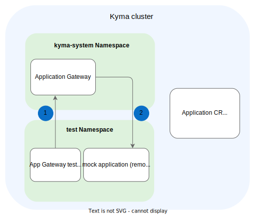
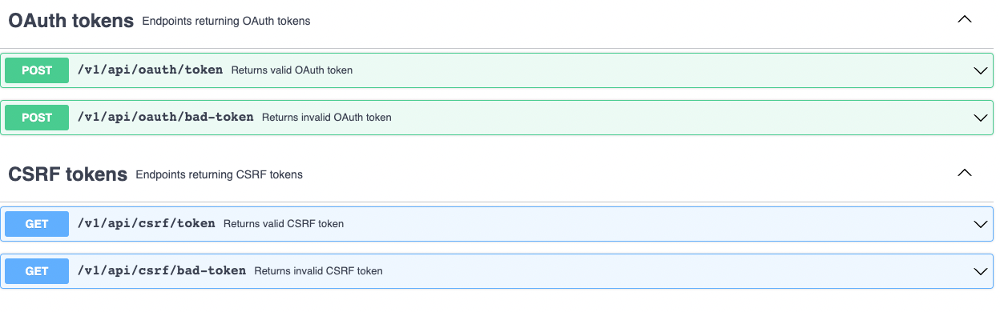
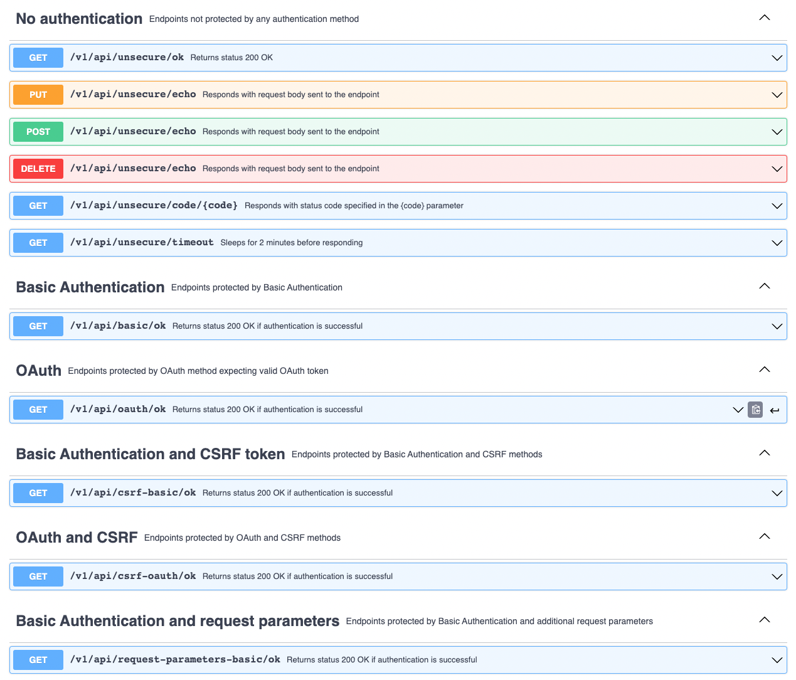
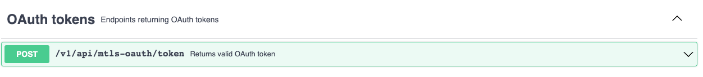

# Application Gateway

**Table of Contents**

- [Application Gateway](#application-gateway)
  - [Design and Architecture](#design-and-architecture)
  - [Mock Application](#mock-application)
    - [Certificates](#certificates)
    - [API Exposed on Port `8080`](#api-exposed-on-port-8080)
    - [API Exposed on Port `8090`](#api-exposed-on-port-8090)
    - [API Exposed on Port `8091`](#api-exposed-on-port-8091)
  - [Building](#building)
  - [Running](#running)
    - [Deploy a Kyma Cluster Locally](#deploy-a-kyma-cluster-locally)
    - [Run the Tests](#run-the-tests)
  - [Debugging](#debugging)
    - [Running Locally](#running-locally)
    - [Running Without Cleanup](#running-without-cleanup)
      
## Design and Architecture

The tests consist of:
- [Application CRs](../resources/charts/gateway-test/charts/test/templates/applications/) describing the test cases
- [Secrets](../resources/charts/gateway-test/charts/test/templates/applications/credentials) referenced by the Application CRs
- [Test runners](../test/application-gateway/) with various checks for the subsets of cases, grouped by the Application CRs
- [Mock application](../tools/external-api-mock-app/) which simulates the remote endpoints

Additionally, the following resources are created on the cluster:
- [Service Account](../resources/charts/gateway-test/charts/test/templates/service-account.yml) used by the tests to read the Application CRs
- [Secrets](../resources/charts/gateway-test/charts/test/templates/applications/credentials) used by the Mock application to configure mTLS servers

The tests are executed as a Kubernetes Job on a Kyma cluster where the tested Application Gateway is installed.
The test Job and the mock application deployment are in the `test` namespace.



## Mock Application

Mock application exposes the following APIs:
- API on port `8080` implementing various authentication methods and returning the `OAuth` and `CSRF` tokens
- API on port `8090` implementing the `mTLS` authentication and returning the `OAuth` tokens
- API on port `8091` implementing the `mTLS` authentication and using an expired server certificate

### Certificates

To test mTLS-related authentication methods, you need:
- Server certificate, key, and the CA certificate for the mock application
- Client certificate and key stored in a Secret accessed by Application Gateway

All certificates are generated using the **generate-certs** target from the `Makefile`.
The target is executed before the tests are run, and it invokes [`generate-self-signed-certs.sh`](../scripts/generate-self-signed-certs.sh), which creates the CA root, server, and client certificates and keys.

> [!NOTE]
> Since self-signed certificates are used, Application CRs have the **skipVerify: true** property set to `true` to force Application Gateway to skip certificate verification.

### API Exposed on Port `8080`

To get tokens for the `OAuth` and `CSRF` protected endpoints, we have the following API:


To test authentication methods, we have the following API:


The credentials used for authentication, such as `user` and `password`, are [hardcoded](../tools/external-api-mock-app/config.go).

### API Exposed on Port `8090`

To get tokens for the `OAuth` protected endpoints, we have the following API:


To test authentication methods, we have the following API:


The credentials used for authentication, such as `clientID`, are [hardcoded](../tools/external-api-mock-app/config.go).
The server key, server certificate, and the CA root certificate for port `8090` are defined in [this Secret](../resources/charts/gateway-test/charts/mock-app/templates/credentials/mtls-cert-secret.yml).

> [!NOTE]
> Port `8090` must be excluded from redirection to Envoy, otherwise Application Gateway cannot pass the client certificate to the mock application.

### API Exposed on Port `8091`

This API is identical to the one exposed on port `8090`.
The HTTPS server on port `8091` uses an expired server certificate.
The server key, server certificate, and the CA root certificate for port `8091` are defined in [this Secret](../resources/charts/gateway-test/charts/mock-app/templates/credentials/expired-mtls-cert-secret.yaml).

> [!NOTE]
>  Port `8091` must be excluded from redirection to Envoy, otherwise Application Gateway cannot pass the client certificate to the mock application.

## Building

Pipelines build the mock application and the Gateway test using the **release** target from the `Makefile`.

To build **and push** the Docker images of the tests and the mock application, run:

``` sh
./scripts/local-build.sh {DOCKER_TAG} {DOCKER_PUSH_REPOSITORY}
```

This will build the following images:
- `{DOCKER_PUSH_REPOSITORY}/gateway-test:{DOCKER_TAG}`
- `{DOCKER_PUSH_REPOSITORY}/mock-app:{DOCKER_TAG}`

## Running

Tests can be run on any Kyma cluster with Application Gateway.

Pipelines run the tests using the **test-gateway** target from the `Makefile`.

### Deploy a Kyma Cluster Locally

1. Provision a local Kubernetes cluster with k3d:
   ```sh
   kyma provision k3d
   ```

2. Install the minimal set of components required to run Application Gateway for either Kyma OS or SKR:

    <div tabs name="Kyma flavor" group="minimal-kyma-installation">
    <details open>
    <summary label="OS">
    Kyma OS (standalone mode)
    </summary>

    ```sh
    kyma deploy --components-file ./resources/installation-config/mini-kyma-os.yaml
    ```

    </details>
    <details>
    <summary label="SKR">
    SKR (Compass mode)
    </summary>

    ```bash
    kyma deploy --components-file ./resources/installation-config/mini-kyma-skr.yaml 
    ```

    </details>
    </div>

   > [!TIP]
   > Read more about Kyma installation in the [official Kyma documentation](https://kyma-project.io/#/02-get-started/01-quick-install).

### Run the Tests

``` sh
make -f Makefile.test-application-gateway test-gateway
```

By default, the tests clean up after themselves, removing all the previously created resources and the `test` namespace.

> [!WARNING]
> If the names of your existing resources are the same as the names used in the tests, running this command overrides or removes the existing resources.

## Debugging

### Running Locally

> [!WARNING]
> Because of the way it accesses the Application CRs, the test Job must run **on a cluster**.
> Application Gateway and the mock application can both be run locally.

To run the mock application locally, follow these steps:

1. Change all the **targetUrl** values in the [Application CRs](../resources/charts/gateway-test/charts/test/templates/applications/) to reflect the new application URL. For example, `http://localhost:8081/v1/api/unsecure/ok`.
2. Change all the **centralGatewayUrl** values to reflect the new Application Gateway URL. For example, `http://localhost:8080/positive-authorisation/unsecure-always-ok`.
3. Deploy all the resources on the cluster.

> [!NOTE]
> You can omit the test Job and the Central Gateway, but it's easier to just let them fail.

4. Build the mock application:

   <div tabs name="Mock App Build Flavor" group="mock-app-flavor">
   <details open>
   <summary label="dockerized">
   Docker
   </summary>

   ```shell
   export DOCKER_TAG="local"
   export DOCKER_PUSH_REPOSITORY="{DOCKER_USERNAME}"
   make image-mock-app
   ```

   </details>
   <details>
   <summary label="local">
   Local
   </summary>

   Change the hardcoded application port in [`config.go`](../tools/external-api-mock-app/config.go), and run:
   ```shell
   go build ./tools/external-api-mock-app/
   ```
   </details>
   </div>
5. Run the mock application:

   <div tabs name="Mock App Run Flavor" group="mock-app-flavor">
   <details open>
   <summary label="dockerized">
   Docker
   </summary>

   ```shell
   docker run -p 8180:8080 -p 8190:8090 -v "$PWD/resources/charts/gateway-test/charts/test/certs/positive:/etc/secret-volume:ro" -v "$PWD/resources/charts/gateway-test/charts/test/certs/negative:/etc/expired-server-cert-volume:ro" "$DOCKER_PUSH_REPOSITORY/mock-app:$DOCKER_TAG"
   ```

   </details>
   <details>
   <summary label="local">
   Local
   </summary>

   ```shell
   ./external-api-mock-app
   ```
> [!WARNING]
> For the certificates to work, you must copy them from `./k8s/gateway-test/certs` to `/etc/secret-volume`.

   </details>
   </div>
6. Run [Application Gateway](https://github.com/kyma-project/kyma/tree/main/components/central-application-gateway) with the `-kubeConfig {PATH_TO_YOUR_KUBECONFIG_FILE}` parameter.

You can now send requests to Application Gateway, and debug its behavior locally.

### Running Without Cleanup

To run the tests without removing all the created resources afterwards, run them in the debugging mode.

1. To start the tests in the debugging mode, run:

   ``` shell
   make disable-sidecar-for-mtls-test test-gateway-debug
   ```

2. Once you've finished debugging, run:

   ``` shell
   make clean-gateway-test enable-sidecar-after-mtls-test
   ```

