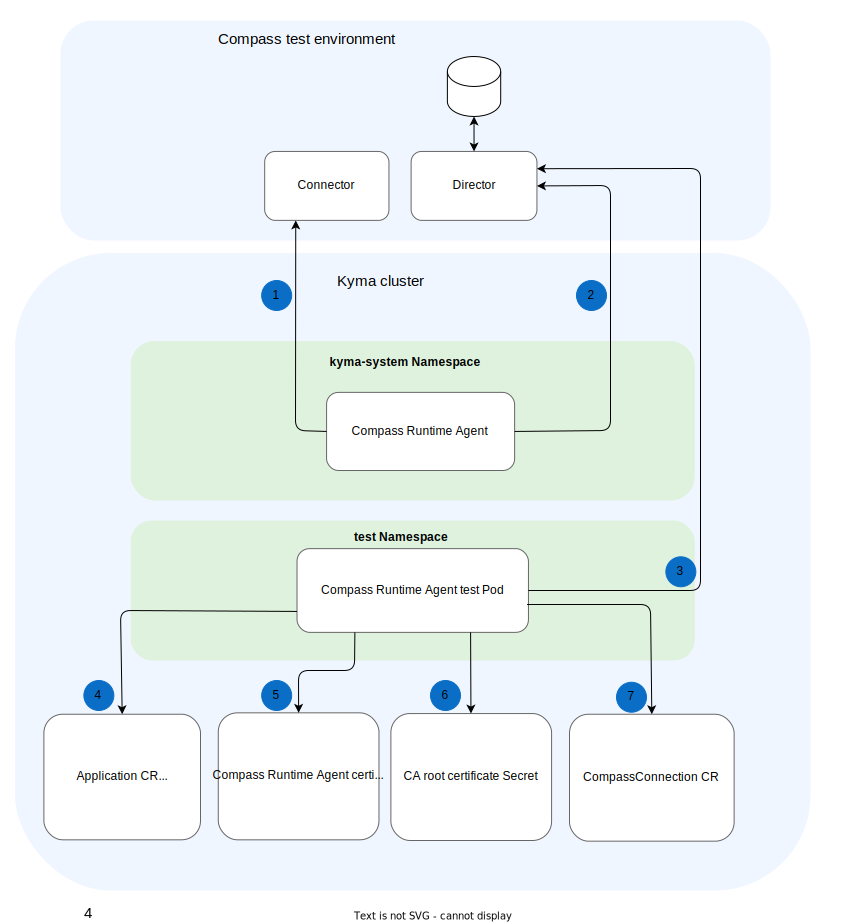

# Compass Runtime Agent

**Table of Contents**

- [Compass Runtime Agent](#compass-runtime-agent)
  - [Design and Architecture](#design-and-architecture)
  - [Building](#building)
  - [Running](#running)
    - [Deploy a Kyma Cluster Locally](#deploy-a-kyma-cluster-locally)
    - [Test Setup - Compass Runtime Agent Configuration](#test-setup---compass-runtime-agent-configuration)
    - [Run the Tests](#run-the-tests)
  - [Debugging](#debugging)
    - [Running Without Cleanup](#running-without-cleanup)
    - [Debugging in the IDE](#debugging-in-the-ide)

## Design and Architecture

The tests consist of:
- [Test resources](../resources/charts/compass-runtime-agent-test/) used to perform the test
- [Test runner](../test/application-connectivity-validator/) with all the test cases

The tests are executed as a Kubernetes Job in a Kyma cluster where the tested Compass Runtime Agent is installed. The test Job is deployed in the `test` namespace.



The interactions between components are the following:

1. Compass Runtime Agent periodically fetches certificates from Compass Connector.
2. Compass Runtime Agent periodically fetches applications from Compass Director.
3. Compass Runtime Agent Test sends GraphQL mutations to Compass Director to create, modify, or delete Applications.
4. Compass Runtime Agent Test verifies whether corresponding Application CRs were created, modified, or deleted.
5. Compass Runtime Agent Test verifies whether the Secret with certificates used for communication with Director was created.
6. Compass Runtime Agent Test verifies whether the Secret with the CA root certificate used by Istio Gateway was created.
7. Compass Runtime Agent Test verifies the content of the CompassConnection CR.

## Building

Pipelines build the Compass Runtime Agent test using the **release** target from the `Makefile`.

To build **and push** the Docker images of the tests, run:

```bash
./scripts/local-build.sh {DOCKER_TAG} {DOCKER_PUSH_REPOSITORY}
```

This builds the following images:
- `{DOCKER_PUSH_REPOSITORY}/compass-runtime-agent-test:{DOCKER_TAG}`

## Running

Tests can be run on any Kyma cluster with Compass Runtime Agent.

Pipelines run the tests using the **test-compass-runtime-agent** target from the `Makefile`.

### Deploy a Kyma Cluster Locally

1. Provision a local Kubernetes cluster with k3d:
   ```bash
   k3d registry create kyma-registry --port 5001
   k3d cluster create kyma --kubeconfig-switch-context -p 80:80@loadbalancer -p 443:443@loadbalancer --registry-use kyma-registry
   kubectl create ns kyma-system
   ```

2. Install the minimal set of components required to run Compass Runtime Agent **for Kyma SKR (Compass mode)**:

    ```bash
    kyma deploy --components-file ./resources/installation-config/mini-kyma-skr.yaml --value global.disableLegacyConnectivity=true --value compassRuntimeAgent.director.proxy.insecureSkipVerify=true
    ```

   >**TIP:** Read more about [Kyma installation](https://kyma-project.io/#/02-get-started/01-quick-install).

### Test Setup - Compass Runtime Agent Configuration

The [`values.yaml`](../resources/charts/compass-runtime-agent-test/values.yaml) file contains environment variables that are used in the Compass Runtime Agent tests. These values can be modified as needed.

- **APP_DIRECTOR_URL** - Compass Director URL
- **APP_TESTING_TENANT** - Tenant used in GraphQL calls
- **APP_SKIP_DIRECTOR_CERT_VERIFICATION** - Skip certificate verification on the Director side
- **APP_OAUTH_CREDENTIALS_SECRET_NAME** - Secret name for Compass OAuth credentials
- **APP_OAUTH_CREDENTIALS_NAMESPACE** - Namespace for Compass OAuth credentials

### Run the Tests

1. Before running the test export the following environment variables
   - **COMPASS_HOST** - host running Compass 
   - **COMPASS_CLIENT_ID** - client ID used for fetching authorization tokens
   - **COMPASS_CLIENT_SECRET** - client Secret used for fetching authorization tokens 

2. To start the tests, run:

   ```bash
   make test-compass-runtime-agent
   ```

By default, the tests clean up after themselves, removing all the previously created resources and the `test` namespace.

> **CAUTION:** If the names of your existing resources are the same as the names used in the tests, running this command overrides or removes the existing resources.

## Debugging

### Running Without Cleanup

To run the tests without removing all the created resources afterwards, run them in the debugging mode.

1. To start the tests in the debugging mode, run:

   ```bash
   make test-compass-runtime-agent-debug
   ```

2. Once you've finished debugging, run:

   ```bash
   make clean-test-compass-runtime-agent-test
   ```

### Debugging in the IDE

To run the test in your IDE, perform the following steps.

1. To prepare the cluster for debugging, run the test without cleanup:

   ```bash
   make test-compass-runtime-agent-debug
   ```

2. Before starting debugger in your IDE export the following environment variables:
   - `KUBECONFIG={Your cluster kubeconfig}`
   - `APP_DIRECTOR_URL=https://compass-gateway-auth-oauth.{COMPASS_HOST}/director/graphql`
   - `APP_TESTING_TENANT=3e64ebae-38b5-46a0-b1ed-9ccee153a0ae`
   - `APP_OAUTH_CREDENTIALS_SECRET_NAME=oauth-compass-credentials`
   - `APP_OAUTH_CREDENTIALS_NAMESPACE=test`

3. Start the debugging session.

4. Once you've finished debugging, run:

   ```bash
   make clean-test-compass-runtime-agent-test
   ```
