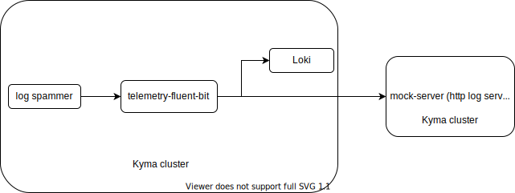
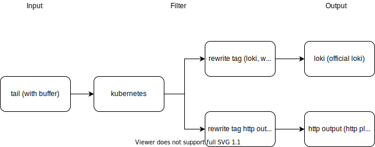
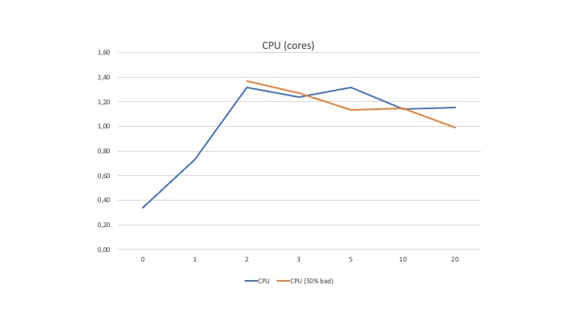
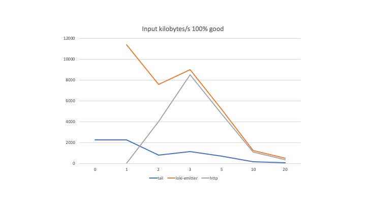
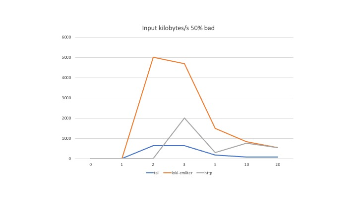
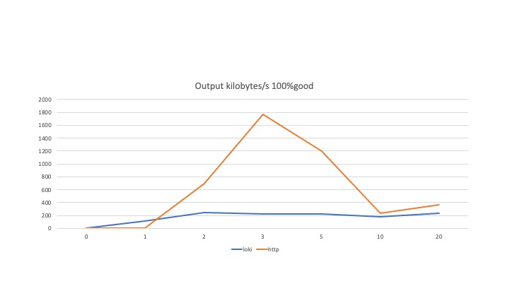
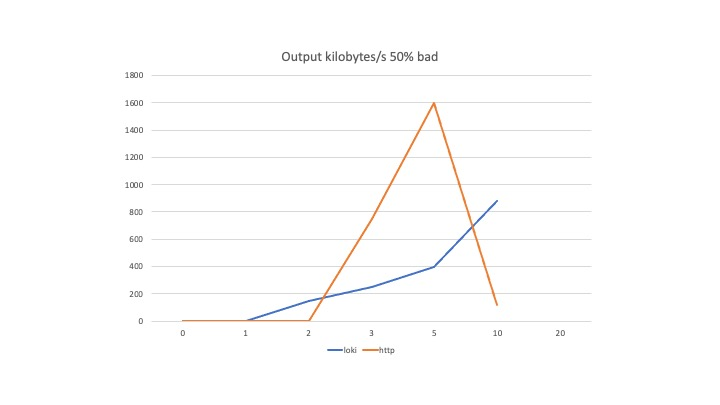

# Performance with multiple pipelines

Here, we executed performance tests to understand the impact on memory, cpu and throughput by increasing the number of pipelines.

We performed tests with the following number of `pipelines`: 0,1,2,3,5,10,20. 
In the test, we measured the `memory/cpu` consumption immediately after deploying the pipelines, and again after 10 minutes. For generating huge amount of logs, we used a `log spammer` and a `http logging backend` (mockserver) in a different Kyma cluster.

## The setup

See the cluster setup:

See the Fluent Bit setup:

## Summary

See the following summary of the tests performed. For more detailed results, check the graphs section below.

- Idle CPU is .31.
- Increasing CPU increases the rate at which inputs are read.
- The average CPU usage is around 1.2 for up to 20 pipelines. The CPU plateaus after 2 pipelines.
- Memory is usually not a problem for low number of pipelines. For 10 pipelines, we had to increase memory to 512 MB.
5. The memory increases linearly
- With 1.5CPU/512 Mi memory, we can support 20 pipelines (under extreme conditions).
- With two pipelines, when one pipeline (http server) is down, we see that the output and emitter throughput goes down to 0.
   However, in the filesystem buffer, the chunks are rolled. There are no logs saying why the output stops functioning.

## Learnings
- [Health check](https://docs.fluentbit.io/manual/administration/monitoring#health-check-for-fluent-bit) had to be adjusted because due to the higher error rate, Fluent Bit would mark the Pod unhealthy.
- To improve the [performance](https://www.mock-server.com/mock_server/performance.html) of mockserver, we had to reduce the memory consumption. Logging the messages to stdout was disabled and the log level was changed to `trace`.
- Over a period of time, the http output throughput was declining. After restarting mockserver, it increased again. It looks like an issue with mockserver.
- Loki was running out of memory. We had to increase the memory of Loki to 1Gi.
- Increasing the [http worker count](https://docs.fluentbit.io/manual/pipeline/outputs/http) to 10 increased the CPU usage but did not have any affect on the throughput.

## Results

- CPU cores utilization

    

- Memory utilization

    

- Input throughput: All pipelines are good.

    

4. Output throughput: 50% pipelines are bad.
    
    

- Output throughput: All pipelines are good.

    

6. Output throughput: 50% pipelines are bad.

    